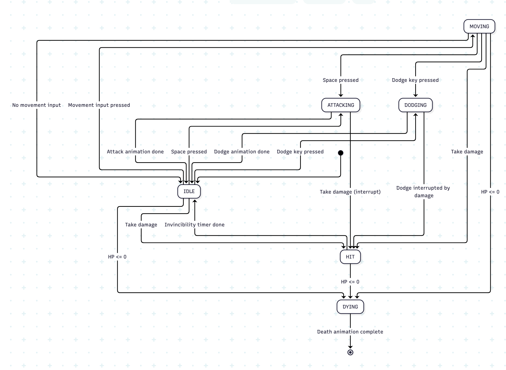
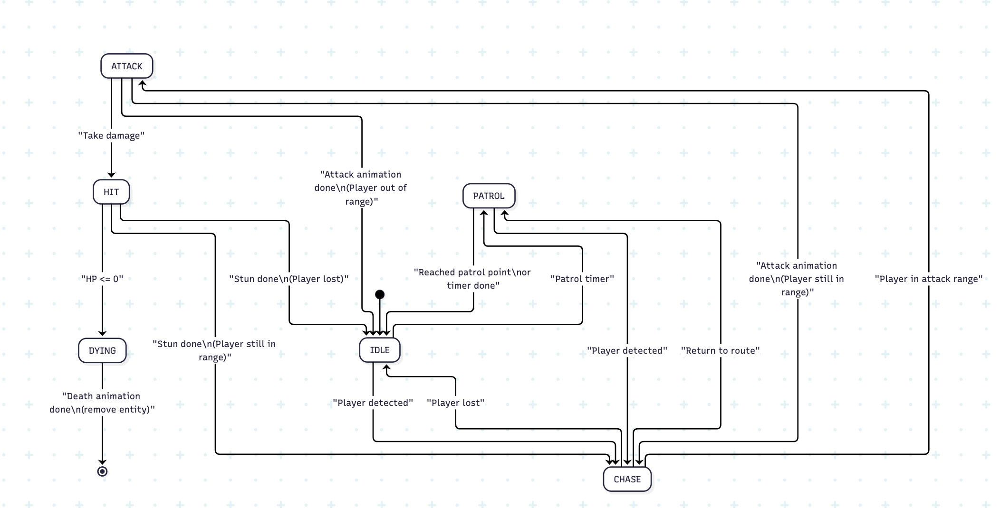
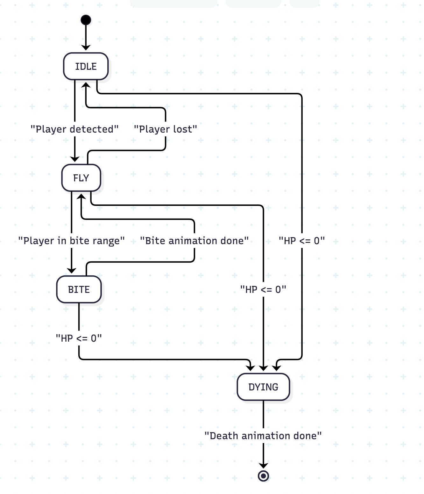
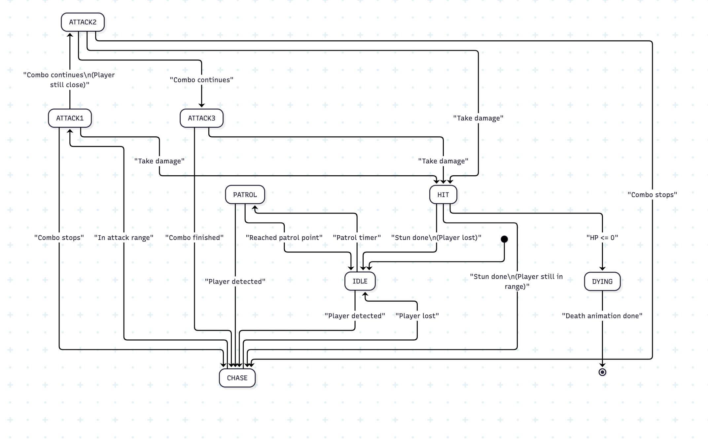
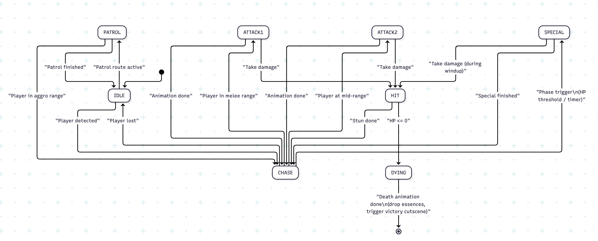

# Final Project

-   [ ] Read the [project requirements](https://vikramsinghmtl.github.io/420-5P6-Game-Programming/project/requirements).
-   [ ] Replace the sample proposal below with the one for your game idea.
-   [ ] Get the proposal greenlit by Vik.
-   [ ] Place any assets in `assets/` and remember to update `src/config.json`.
-   [ ] Decide on a height and width inside `src/globals.js`. The height and width will most likely be determined based on the size of the assets you find.
-   [ ] Start building the individual components of your game, constantly referring to the proposal you wrote to keep yourself on track.
-   [ ] Good luck, you got this!

---

**AI Disclaimer:** This proposal was written by me. I used AI assistance to refactor the content for clarity, formatting, and improved wording. All game design decisions, architecture choices, and content are my own.

**Note for Teacher:** Before you read this, I recognize this proposal might seem like a lot, but I am convinced I can get it done and it will all work nicely. I am heavily leaning towards removing the stat system entirely (essence upgrades), but I wanted to leave it here to let you confirm whether you think it's necessary or if I should simplify further.

---

# Game Proposal – Echoes of the Fallen Star

## Description

**Working Title:** Echoes of the Fallen Star

**Platform:** HTML5 Canvas (provided engine / framework)

**Genre:** Top-down action RPG with dark fantasy themes and character progression.

**Core fantasy:**

You were once a legendary warrior. During your final battle, you were struck by a forbidden ritual that ripped your spirit from your body. Your soul didn't pass on - it mutated into a Shadow Form, a drifting, broken, half-forgotten being. Your goal: reclaim your humanity by defeating the guardians who were once your allies, now corrupted by the same ritual that stole your body.

**Core loop:**

Explore zones → Fight enemies → Collect essences → Use essences to upgrade ATK or HP → Fight stronger enemies → Defeat corrupted guardians → Eventually defeat everyone

Simple, focused, and doable.

**Scope for this project (v1):**

For this course, I will implement a compact first chapter of this game:

-   Few combat zones(5 lets say but considering procedurally just having a lot, ill design 5 but will seem like a lot) (Temple entrance, corridors, boss chambers,etc)
-   1 boss (Temple Guardian final boss)
-   3–4 enemy types (Shadow Bat swarms, Spirit Boxer enforcers, Temple Guardian boss)
-   Simple progression: Essences → Upgrade ATK or HP
-   Story cutscenes: Static background images with text dialogue panels (intro cutscene explaining the backstory, mid-game story moments, and victory cutscene after defeating the Temple Guardian)

**Nice to have plans (not in unless you think my project is too small):**

-   Inventory/equipment systems
-   Complex stat allocation
-   XP/leveling/gold/shop systems
-   More enemy types and deeper story

## Gameplay

The player controls the Shadow Creature (their corrupted spirit form) using keyboard input (WASD for movement, Space for attacking). The Shadow Creature floats instead of walking . Players explore temple zones, encountering various enemies that spawn and chase. Combat is real-time and action-oriented, with the player able to perform basic attacks and dodge.

As enemies are defeated, they drop:

Note on Essence Drops: Currently planned for enemies to drop essences on death, but this mechanic is under consideration and may be taken out if you think this is too much.

-   **Essences** – consumed to permanently increase ATK or HP

The progression system is simple: collect essences from defeated enemies, then use them to upgrade either your Attack or Health. That's it. No XP, no leveling, no gold, no shops, no equipment. Just essences → upgrade ATK or HP.

Combat involves:

-   Melee attacks
-   Dodge (quick sidestep) for invincibility frames
-   Enemy AI that patrols, chases, and attacks
-   Boss fights with telegraphed attacks and multiple phases
-   Death animations: All characters (player and enemies) have death animations that play when HP reaches 0, providing visual feedback before transitioning to game over or removal

The game is played with keyboard controls. Players can pause the game at any time (ESC key) to access the pause menu.

**Juice & Polish:**

Juice effects to enhance player feedback:

-   **Particle Effects**: Dark particles on enemy death, glowing particles when collecting essences, spark effects on attack impacts
-   **Screen Shake**: Camera shake on boss attacks, heavy damage, and enemy death explosions
-   **Visual Feedback**: Flashing red on damage, invincibility flicker (sprite alpha tween), hit stun animations
-   **Stagger/Knockback**: Enemy knockback animations when hit, player knockback on heavy damage
-   **Smooth Transitions**: Tweens for direction changes, UI fade-ins, map transitions, and camera movements

These effects use the `Timer.js` library's `tween()` method to interpolate values over time, creating smooth, satisfying animations that make combat feel impactful and responsive.

**Temple Guardian Boss Fight - Maximum Juice:**

The final boss fight against the Temple Guardian is going to be the most polished and impactful encounter in the game, with extensive juice effects:

-   **Special Attack Telegraphed Animation**: The Temple Guardian raises his sword above his head, which begins to glow with increasing intensity. This visual telegraph gives players time to react and dodge.
-   **Screen Shake on Special Attack**: Heavy camera shake when the special attack lands or when the sword strikes the ground, emphasizing the power of the attack.
-   **Screen Shake on Heavy Hits**: Camera shake when the player takes significant damage or when the boss is hit with powerful attacks.
-   **Particle Effects**:
    -   Glowing energy particles around the sword during special attack charge
    -   Explosive particle burst on special attack impact
    -   Dark shadow particles when the boss takes damage
    -   Dramatic particle effects on boss death
-   **Visual Feedback**:
    -   Screen flash/color overlay when special attack hits
    -   Boss stagger animation when taking heavy damage
    -   Glowing aura effects during phase transitions
-   **Audio Emphasis**: Special attack charge sound builds in intensity, impact sound is powerful and satisfying
-   **Phase Transitions**: Smooth visual transitions between boss phases with screen effects and particle bursts

This boss fight serves as the culmination of the game, so it receives the most attention to detail and polish. The goal is to make every attack feel impactful and every dodge feel rewarding.

**Note on Essence Drops**: Currently planned for enemies to drop essences on death, but this mechanic is under consideration and may be taken out if you think this is too much.

**Save System:**

-   **Manual Save:** Players can save their game at any time via the pause menu (ESC → Save Game). This saves the complete game state including:
    -   Player position and current map
    -   Player HP and ATK stats
    -   Collected essences count
    -   Map progress and defeated enemies
    -   Current game state (allows resuming exactly where you left off)
-   **Auto-Save:** The game automatically saves when defeating bosses
-   **Continue:** The "Continue" option on the title screen loads the last saved game state, allowing players to close the browser tab and resume exactly where they saved

**Story & Cutscenes:**

_Note: Cutscenes are an extra feature and not fully necessary for the core game, but I'm including them because I can use tweening to create smooth transitions between screens, and it's a nice feature that won't take too much time to implement._

The game features story cutscenes that deliver the narrative between gameplay segments. Cutscenes are simple static pages with text - no animation or complex sequences. They use:

-   Static background images (full screen) to set the scene
-   Text panel at the bottom displaying dialogue
-   Character names (optional) and dialogue text
-   Space/Enter to advance dialogue
-   ESC to skip (optional)

Cutscenes appear at:

-   Game start (intro cutscene explaining the backstory)
-   Mid-game story moments (when reaching key locations or defeating certain enemies)
-   Victory (ending cutscene after defeating the final boss)

### Direction Handling for Enemies

**Player (Shadow Creature):** Has full 8-directional sprites (N, NE, E, SE, S, SW, W, NW) - perfect for top-down gameplay.

**Enemies without 8 directions:**

-   **Temple Guardian & Spirit Boxer:** These enemies use sprite flipping (horizontal mirror) to face left/right. They automatically face the player's direction using angle calculation:
    -   Calculate angle from enemy to player
    -   If angle is in left half (180° to 360°), flip sprite horizontally
    -   If angle is in right half (0° to 180°), use normal sprite
    -   This creates the illusion of facing the player without needing 8-directional sprites
-   **Shadow Bat:** As a flying enemy, it doesn't need directional sprites. The bat animations work from any angle, and the sprite can be rotated slightly to face movement direction if needed.

This approach allows all enemies to feel responsive and face the player appropriately while working within the sprite limitations.

## Requirements

### State Machines

-   **Global State Machine**: Manages game flow (TitleScreen, Instructions, Cutscene, Play, Pause, Upgrade, GameOver, Victory)
-   **Entity State Machines**: Player and Enemy entities each have their own state machines
    -   Player: IDLE, MOVING, ATTACKING, DODGING, HIT, DYING
    -   Enemies: IDLE, PATROL, CHASE, ATTACK, HIT, DYING (with variations per enemy type)

### Inheritance & Polymorphism

-   **Inheritance Hierarchy**: GameObject → Entity → Player/Enemy → Enemy subclasses (ShadowBat, SpiritBoxer, TempleGuardian)
-   **Polymorphism**: CollisionManager uses Collidable interface to polymorphically check collisions across Entity, EssencePickup, and EnvironmentalObject types
-   **Entity Arrays**: Polymorphic iteration through Entity arrays for updates and rendering

### Factory Design Pattern

-   **EnemyFactory**: Centralizes enemy creation logic with methods for each enemy type (createShadowBat, createSpiritBoxer, createTempleGuardian)
-   Uses EnemyType enum to determine which enemy to create

### Enums

-   **Direction**: 8-directional movement (N, NE, E, SE, S, SW, W, NW)
-   **PlayerState**: Player state machine states
-   **EntityState**: Enemy state machine states
-   **GameStateName**: Global game states
-   **EnemyType**: Enemy types for factory pattern
-   All magic numbers and strings eliminated through enum usage

### Game Entities & Game Objects

-   **Entities**: Player, Enemy (ShadowBat, SpiritBoxer, TempleGuardian) - intelligent objects with AI, state machines, and behaviors
-   **Game Objects**: EssencePickup (collectible), EnvironmentalObject (static obstacles) - simpler objects that entities interact with

### Collision Detection & Hitboxes

-   **Tile-based Collision**: Tiled map collision layer for player movement and environment boundaries
-   **Entity Collision**: Player vs Enemy attacks, Enemy vs Player attacks, Entity vs Pickup collection
-   **Hitbox System**: Uses Hitbox library class which implements AABB (Axis-Aligned Bounding Box) collision detection - the Hitbox class wraps the `isAABBCollision` function from CollisionHelpers.js, providing a clean object-oriented interface for collision detection between entities

### Persistence

-   **Full Game State Saving**: SaveManager saves complete game state to localStorage including:
    -   Player position, HP, ATK, essence count
    -   Current map and map progress
    -   Enemy states (defeated/spawned)
    -   Pickup states (collected essences)
    -   Game flags (bosses defeated, cutscenes viewed)
-   **Manual Save**: Available anytime via pause menu
-   **Auto-Save**: Triggers when defeating bosses

### Win & Loss Conditions

-   **Win Condition**: Defeat Temple Guardian (final boss) → VictoryState → Victory cutscene
-   **Loss Condition**: Player HP <= 0 → Death animation → GameOverState

### Score/Points/Prizes

-   **Essence System**: Collect essences from defeated enemies
-   **Upgrade System**: Use essences to permanently upgrade ATK or HP
-   **Progression**: Simple, focused progression system (essences → upgrades)

### Sprites

-   All visual elements use sprite-based graphics (no colored canvas shapes)
-   Player: Shadow Creature with 8-directional sprites
-   Enemies: Shadow Bat, Spirit Boxer, Temple Guardian with multiple animation sprites
-   Environment: Terrain tiles, temple structures
-   UI: HP bar, buttons, upgrade interface
-   All sprite sources properly credited

### Animations

-   **Animation System**: Uses Animation.js library class for sprite sheet animations
-   **Player Animations**: Idle (8 directions), attack, dodge, death
-   **Enemy Animations**: Idle, walk/run/fly, attack chains, hit/damaged, death
-   **Death Animations**: All characters have dedicated death animations
-   **Hit Animations**: Some characters have hit/damaged animations for visual feedback

### Tweens

-   **Direction Tweening**: Smooth player rotation through intermediate directions
-   **Map Transitions**: Fade out/in and camera pan tweens when transitioning between maps
-   **UI Transitions**: Menu fade-ins, button hover effects
-   **Combat Tweens**: Knockback animations, camera shake
-   Uses Timer.js library's `tween()` method for all interpolations

### Sounds & Music

-   **Background Music**: Ambient tracks for title screen, gameplay zones, and boss fights
-   **Sound Effects**: Player attack, enemy hit/death, player hurt, essence pickup, menu interactions, dodge, boss attack telegraphs
-   All sound sources properly credited

### Fonts

-   **Title Font**: Stylized font for game title and major headings (e.g., Orbitron, Exo 2)
-   **Body Font**: Clean, readable font for HUD, menus, and dialogue (e.g., Roboto, Inter)
-   Different fonts used for different parts of the game
-   All font sources properly credited

### Instructions

-   **InstructionsState**: Dedicated state accessible from title screen showing:
    -   Controls (WASD movement, Space attack, Dodge key)
    -   Gameplay mechanics (essence collection, upgrades)
    -   Objectives (defeat Temple Guardian)

### Juice

-   **Particle Effects**: Enemy death particles, essence collection particles, attack impact sparks
-   **Screen Shake**: Camera shake on boss attacks, heavy damage, enemy death explosions
-   **Visual Feedback**: Damage flash, invincibility flicker, hit stun animations
-   **Stagger/Knockback**: Enemy and player knockback animations
-   **Smooth Transitions**: Direction tweens, UI fades, map transitions
-   **Boss Fight Polish**: Maximum juice effects for Temple Guardian fight (special attack telegraphs, screen shake, particle bursts)

### 📊 User Interface

-   **HUD Elements**: Player HP bar (top-left), essence count, current stats
-   **Menus**: Title screen, pause menu, upgrade interface
-   **Cutscenes**: Text panel UI for dialogue
-   All UI elements clearly display core game information

### 🤖 State Diagrams

> [!note]
> Remember that you'll need diagrams for not only game states but entity states as well.

#### Global Game State Machine

The **Global Game State Machine** manages high-level game flow and satisfies the rubric requirement for "state machine to control the state of the game globally."

**Key States:**

-   **TitleScreenState**: Initial menu with "New Game", "Continue", and score display
-   **InstructionsState**: Shows game controls, gameplay mechanics, and objectives - accessible from title screen
-   **CutsceneState**: Story cutscenes with static backgrounds and dialogue panels (intro, mid-game, ending)
-   **PlayState**: Main gameplay - handles map rendering, entity updates, collision detection, map transitions
-   **PauseState**: Overlay menu for pausing, upgrades, saving, and quitting
-   **UpgradeState**: Essence upgrade interface (overlay)
-   **GameOverState**: Triggered when player HP reaches 0, shows retry/quit options
-   **VictoryState**: Triggered when all objectives complete, shows play again/quit options

**Transitions:** States transition based on player actions (Enter key, ESC, button clicks), game events (HP <= 0, all enemies defeated), and story triggers. Map transitions within PlayState use fade tweens for smooth transitions between zones.

---

#### Player State Machine (Shadow Creature)

The **Player State Machine** controls the Shadow Creature's behavior and satisfies the rubric requirement for "state machine per game entity."

**States:**

-   **IDLE**: Default state when standing still - player can attack (Space), dodge, or start moving. Uses idle animation (8 directions).
-   **MOVING**: Player is moving with WASD input - uses idle animation (8 directions) since the player floats. Can transition to ATTACKING, DODGING, or return to IDLE when movement stops.
-   **ATTACKING**: Player performs melee attack - attack animation plays, hitbox active, movement disabled. Returns to IDLE when animation completes.
-   **DODGING**: Quick sidestep with invincibility frames - uses dodge animation. Returns to IDLE when animation completes.
-   **HIT**: Brief state when taking damage - invincibility frames active, visual feedback (flash red). Returns to IDLE when invincibility expires, or transitions to DYING if HP <= 0.
-   **DYING**: Death animation plays - triggers GameOverState when complete.

**Transitions:**

-   **IDLE** → **MOVING** when movement input is pressed
-   **IDLE** → **ATTACKING** when Space is pressed
-   **IDLE** → **DODGING** when dodge key is pressed
-   **MOVING** → **IDLE** when movement input stops
-   **MOVING** → **ATTACKING** when Space is pressed (can attack while moving)
-   **MOVING** → **DODGING** when dodge key is pressed
-   **ATTACKING** → **IDLE** when attack animation completes
-   **ATTACKING** → **HIT** if interrupted by damage
-   **DODGING** → **IDLE** when dodge animation completes
-   **DODGING** → **HIT** if interrupted by damage
-   **HIT** → **IDLE** when invincibility timer expires
-   **HIT** → **DYING** if HP <= 0
-   Any state → **DYING** if HP <= 0

The player floats (no walk animation), so both IDLE and MOVING states use the idle animation, with the direction based on movement input.

---

#### Base Enemy State Machine

The **Base Enemy State Machine** provides the foundation for all enemy AI behaviors. Each enemy type extends this with specific variations.

**States:**

-   **IDLE**: Enemy stands still - uses idle animation (if available). Transitions to CHASE/PATROL when player detected.
-   **PATROL**: Enemy moves along patrol path - uses walk/run animation. Used by Temple Guardian and Spirit Boxer.
-   **CHASE**: Enemy moves toward player - uses walk/run/fly animation depending on enemy type. AI calculates path.
-   **ATTACK**: Enemy performs attack animation - attack hitbox active during specific frames. Movement may continue or stop.
-   **HIT**: Enemy takes damage - brief stun/flash. Transitions back to CHASE/IDLE or DYING if HP <= 0.
-   **DYING**: Death animation plays - enemy removed from game when complete. May drop essence pickup.

**Transitions:** States change based on player detection range, attack range, damage taken, and HP thresholds. Each enemy type overrides specific behaviors (e.g., Shadow Bat doesn't patrol, flies directly to player).

---

#### Shadow Bat State Machine

The **Shadow Bat** uses a simplified state machine optimized for swarm enemy behavior.

**States:**

-   **IDLE**: Uses idle animation - brief pause before flying.
-   **FLY**: Uses fly animation - chases player directly (no patrol). Fast movement.
-   **BITE**: Uses bite animation - attack state. Fast transitions.
-   **HIT**: Uses hit animation - brief stun.
-   **DYING**: Uses death animation - removed when complete.

**Key Differences:** No patrol state (flies directly to player), faster state transitions, simpler AI focused on swarm behavior. The bat doesn't need directional sprites since it's a flying enemy.

---

#### Spirit Boxer State Machine

The **Spirit Boxer** uses a combo-based attack system with multiple attack states.

**States:**

-   **IDLE**: Uses idle animation - standing ready.
-   **CHASE**: Uses run animation - moves toward player quickly.
-   **ATTACK1**: First attack in combo chain - uses attack1 animation (6 frames).
-   **ATTACK2**: Second attack in combo chain - uses attack2 animation (13 frames, longest).
-   **ATTACK3**: Third attack in combo chain - uses attack3 animation (10 frames).
-   **HIT**: Uses damaged animation - brief stun.
-   **DYING**: Uses death animation - removed when complete.

**Key Features:** Can chain attacks (ATTACK1 → ATTACK2 → ATTACK3) if player is close. **CHASE** uses run animation for fast movement. May have a **CHARGE** state using run animation with increased speed.

---

#### Temple Guardian State Machine

The **Temple Guardian** (boss) uses the most complex state machine with multiple attack types and phase-based behavior.

**States:**

-   **IDLE**: Standing ready - may have idle animation.
-   **PATROL**: Uses walk animation - moves along patrol path before detecting player.
-   **CHASE**: Uses walk animation - moves toward player (heavy, deliberate movement).
-   **ATTACK1**: Uses attack1 animation - light attack with VFX.
-   **ATTACK2**: Uses attack2 animation - heavier attack with VFX.
-   **SPECIAL**: Uses special animation - telegraphed boss attack with VFX. High damage.
-   **HIT**: Uses hit animation - brief stun when taking damage.
-   **DYING**: Uses death animation - removed when complete.

**Key Features:** Multiple attack types (ATTACK1, ATTACK2, SPECIAL) for varied boss behavior. May have phases (HP thresholds trigger different behaviors). **PATROL/CHASE** uses walk animation for heavy, deliberate movement. **SPECIAL** attacks are telegraphed for player reaction time.

### 🗺️ Class Diagram

The class diagram illustrates the complete architecture of "Echoes of the Fallen Star" and demonstrates all rubric requirements for object-oriented design.

#### Inheritance Hierarchy

**Base Classes:**

-   **GameObject**: Abstract base class providing position (`x`, `y`), dimensions (`width`, `height`), and core methods (`update()`, `render()`)
-   **Entity extends GameObject**: Adds health system (`hp`, `maxHp`), collision detection (`Hitbox`), state management (`EntityStateMachine`), animation (`Animation`, `Sprite`), and movement (`speed`, `direction`)
-   **Player extends Entity**: Player-specific mechanics including attack damage/range, dodge mechanics, invincibility frames, and essence collection
-   **Enemy extends Entity**: Base enemy class with AI behaviors (detection range, patrol paths, target tracking, chase/patrol/attack methods)
    -   **ShadowBat extends Enemy**: Fast swarm enemy with flying behavior
    -   **SpiritBoxer extends Enemy**: Combo-based fighter with charge dash
    -   **TempleGuardian extends Enemy**: Boss enemy with multiple attack types and phase-based behavior

**Game Objects:**

-   **EssencePickup extends GameObject**: Collectible items dropped by enemies
-   **EnvironmentalObject extends GameObject**: Static objects (rocks, walls) providing collision boundaries

#### Design Patterns

**Factory Pattern (🏭 1 point):**

-   **EnemyFactory**: Centralizes enemy creation logic with methods `createShadowBat()`, `createSpiritBoxer()`, `createTempleGuardian()`. Uses `EnemyType` enum to determine which enemy to create.

**State Machine Pattern (🤖 2 points):**

-   **StateMachine**: Base state machine for global game states
-   **EntityStateMachine extends StateMachine**: Entity-specific state machines managing Player and Enemy states (IDLE, MOVING, ATTACKING, etc.)

**Polymorphism (🧱 4 points):**

-   **Collidable interface**: Implemented by `Entity`, `EssencePickup`, and `EnvironmentalObject`, allowing `CollisionManager` to polymorphically check collisions using `isCollidingWith()` and `getCollisionBounds()`
-   **Entity array**: `CollisionManager` maintains arrays of `Entity` references, allowing polymorphic iteration through Player and Enemy subclasses

#### System Classes

-   **Map & MapManager**: Handles Tiled map loading, rendering, and transitions between zones
-   **CollisionManager**: Centralized collision detection system checking entity vs entity, entity vs pickup, and entity vs environment
-   **SaveManager**: Persistence system using localStorage to save/load complete game state
-   **Input**: Keyboard input handling with `isKeyPressed()` and `isKeyHeld()` methods
-   **Camera**: Follows player and manages viewport transformations
-   **Sprite & Animation**: Sprite sheet frame extraction and animation cycling

#### Enums (🔢 1 point)

All magic numbers and strings are eliminated using enums:

-   **Direction**: 8-directional movement (N, NE, E, SE, S, SW, W, NW)
-   **PlayerState**: Player state machine states (IDLE, MOVING, ATTACKING, DODGING, HIT, DYING)
-   **EntityState**: Enemy state machine states (IDLE, PATROL, CHASE, ATTACK, HIT, DYING)
-   **GameStateName**: Global game states (TitleScreen, Instructions, Play, Pause, Upgrade, Cutscene, GameOver, Victory)
-   **EnemyType**: Enemy types for factory pattern (ShadowBat, SpiritBoxer, TempleGuardian)

#### Key Relationships

-   **Inheritance**: GameObject → Entity → Player/Enemy → Enemy subclasses
-   **Composition**: Entity contains Animation, Sprite, EntityStateMachine, Hitbox
-   **Association**: Enemy targets Player, Camera follows Entity, CollisionManager manages arrays of collidable objects
-   **Factory**: EnemyFactory creates Enemy instances based on EnemyType enum

### 🧵 Wireframes

> [!note]
> Your wireframes don't have to be super polished. They can even be black/white and hand drawn. I'm just looking for a rough idea about what you're visualizing.

**Main Menu:**

-   _New Game_ will start a fresh playthrough, resetting all progress.
-   _Continue_ will load the saved game state from localStorage.
-   _Best Echo Score_ will be displayed prominently on the title screen.

The title screen will feature the game's title in a stylized font, with a dark, atmospheric background suggesting the dark fantasy setting.

**Gameplay Screen:**

The gameplay screen will feature:

-   Top-left HUD showing player HP bar
-   Player character in the center, controlled via WASD movement
-   Enemies spawning and patrolling the zone
-   Essence pickups appearing on the ground when enemies die
-   Environment objects (rocks, wreckage) providing collision and visual interest
-   Pause menu accessible via ESC key

A simple upgrade screen (accessible from pause or between zones) will allow players to:

-   Use collected essences to upgrade ATK or HP
-   View current stats

### 🎨 Assets

wireframes will go here
The visual style will be dark and atmospheric, with a dark fantasy/horror aesthetic. The game draws inspiration from top-down action RPGs like _Enter the Gungeon_, _Hades_, and _Risk of Rain_, focusing on clear visual feedback for combat and readable UI elements. The mood is somber and emotional, reflecting the story of a lost warrior trying to reclaim their humanity.

#### 🖼️ Images

Sprites will be created or sourced for:

-   **Player:** Shadow Creature (8 directions: idle, attack, death animations)
-   **Enemies:**
    -   Shadow Bat (swarm enemy - idle, fly, bite, hit, death)
    -   Spirit Boxer (combat enforcer - idle, attack combo chain, run, damaged, death)
    -   Temple Guardian (mini-boss - walk, attack 1, attack 2, special, hit, death)
-   Pickups: essence orbs
-   Environment: terrain tiles, temple structures, dark atmospheric elements
-   UI elements: HP bar, buttons, simple upgrade interface
-   Cutscenes: static background images for story scenes, text panel UI for dialogue

**Note:** The Shadow Creature (player) is the only sprite with full 8-directional support. Other enemies use sprite flipping and angle-based facing to work in a top-down view.

**Death Animations:** All characters (player and all enemy types) have dedicated death animations that play when HP reaches 0. The player's death animation triggers the GameOverState, while enemy death animations play before the enemy is removed from the game and may drop essence pickups.

**Hit/Damage Animations:** Some characters also have dedicated animations that play when taking damage (before death). Shadow Bat and Temple Guardian have "hit" animations, while Spirit Boxer has a "damaged" animation. These animations provide visual feedback when characters are struck, showing brief stun or recoil effects before returning to their normal state.

#### 👥 Character Design & Lore

**Player: Shadow Creature**

-   **Lore:** Your corrupted spirit form - once a legendary warrior, now a drifting shadow
-   **Visual:** Messy, smoky silhouette with glowing eye (last memory)
-   **Movement:** Floating, unpredictable (fits the broken spirit theme)
-   **Abilities:** 8-directional movement, basic attacks, dodge
-   **Role:** The player character

**Shadow Bat (Swarm Enemy)**

-   **Lore:** Failed souls who tried to reclaim their bodies but lost themselves completely
-   **Visual:** Small, flying creature
-   **Movement:** Swarms, screeches, acts as common enemy
-   **Combat:** Fast, dies quickly, attacks in groups
-   **Role:** Common enemy type

**Spirit Boxer (Combat Enforcer)**

-   **Lore:** Manifestation of your lost physical strength
-   **Visual:** Humanoid fighter
-   **Movement:** Combo punches, charge dash, ground slam
-   **Combat:** Medium difficulty, combo-based attacks
-   **Role:** Mid-tier enemy/boss

**Temple Guardian (Mini-Boss #1)**

-   **Lore:** Once your comrade - a knight who swore to protect your body after the ritual. Went insane trying to protect something that no longer exists
-   **Visual:** Rigid, armored, ancient mystical
-   **Movement:** Heavy, deliberate, slow sweeping sword strikes
-   **Combat:** High damage, telegraphed attacks, first major boss
-   **Role:** First big boss encounter

#### ✏️ Fonts

The game will use two distinct fonts:

-   **Title/Headings:** A stylized sci-fi or alien-themed font for the game title, "VICTORY", "GAME OVER", and major UI headings. Examples:

    -   [Orbitron](https://fonts.google.com/specimen/Orbitron) (Google Fonts)
    -   [Exo 2](https://fonts.google.com/specimen/Exo+2) (Google Fonts)
    -   Custom pixel/retro sci-fi fonts from [dafont.com](https://www.dafont.com/)

-   **Body/HUD:** A clean, readable sans-serif font for in-game HUD, menus, tooltips, and dialog. Examples:
    -   [Roboto](https://fonts.google.com/specimen/Roboto) (Google Fonts)
    -   [Inter](https://fonts.google.com/specimen/Inter) (Google Fonts)

#### 🔊 Sounds

All sounds will be sourced from free sound libraries with appropriate licensing:

**Background Music:**

-   Ambient, atmospheric track for Title/Hub area
-   Tension-building track for Crash Site zone
-   Intense, boss-fight music for Core Echo encounter

**Sound Effects:**

-   Player attack (melee swing)
-   Enemy hit/death sounds
-   Player hurt/low HP warning
-   Essence pickup collection
-   Menu click/confirm/back
-   Dodge sound
-   Boss attack telegraphs
-   Cutscene text advance sound (optional)

Potential sources:

-   [freesound.org](https://freesound.org/) (with appropriate Creative Commons licensing)
-   [OpenGameArt.org](https://opengameart.org/) audio section
-   [Incompetech](https://incompetech.com/music/) for background music (Kevin MacLeod)

### 📚 References

-   Top-down action RPG design patterns and game feel
-   State machine architecture for game development
-   HTML5 Canvas game development best practices
-   LocalStorage API for game save/load functionality
