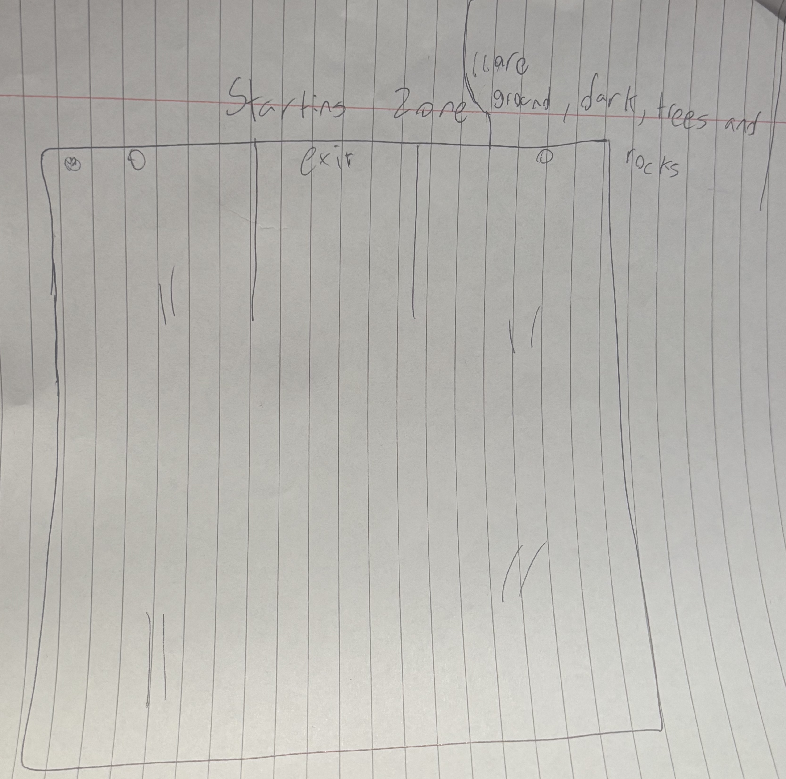
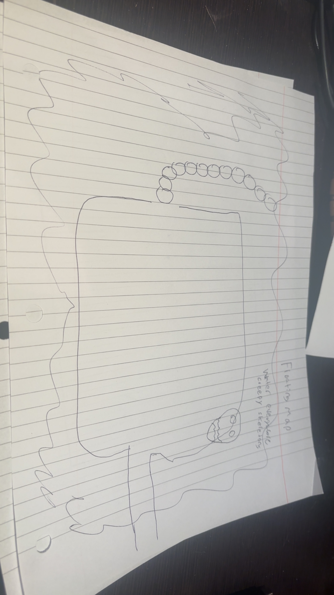
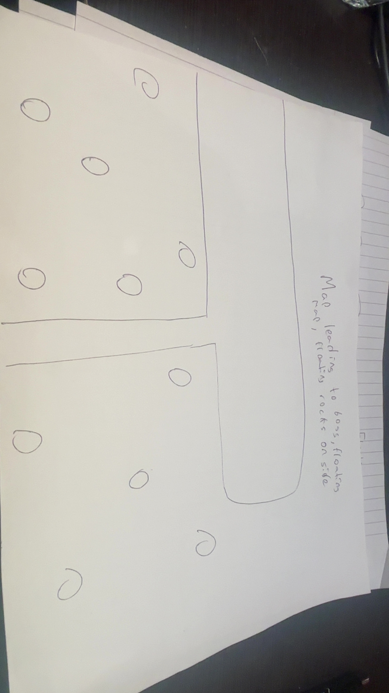
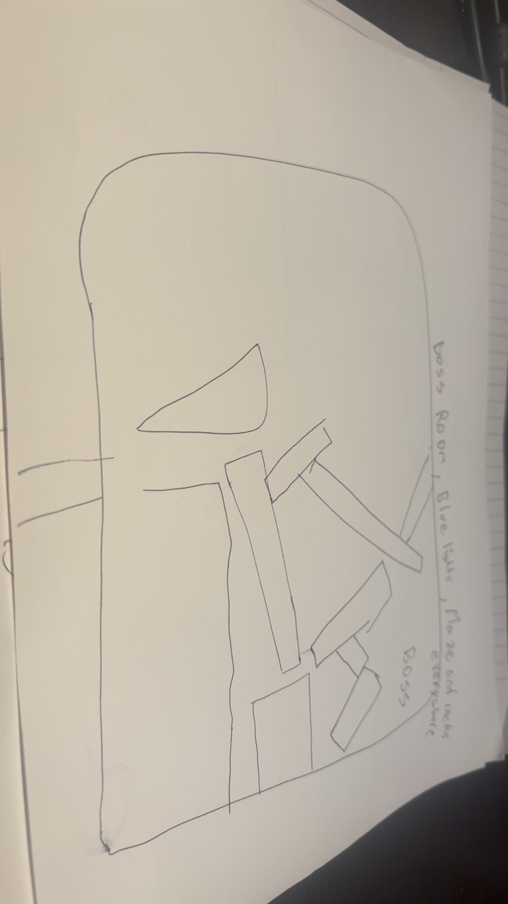

# Final Project

-   [ ] Read the [project requirements](https://vikramsinghmtl.github.io/420-5P6-Game-Programming/project/requirements).
-   [ ] Replace the sample proposal below with the one for your game idea.
-   [ ] Get the proposal greenlit by Vik.
-   [ ] Place any assets in `assets/` and remember to update `src/config.json`.
-   [ ] Decide on a height and width inside `src/globals.js`. The height and width will most likely be determined based on the size of the assets you find.
-   [ ] Start building the individual components of your game, constantly referring to the proposal you wrote to keep yourself on track.
-   [ ] Good luck, you got this!

---

**AI Disclaimer:** This proposal was written by me. I used AI assistance to refactor the content for clarity, formatting, and improved wording. All game design decisions, architecture choices, and content are my own.

---

# Game Proposal – Echoes of the Fallen Star

## Description

**Working Title:** Echoes of the Fallen Star

**Platform:** HTML5 Canvas (provided engine / framework)

**Genre:** Top-down action RPG with dark fantasy themes and character progression.

**Core fantasy:**

You were once a legendary warrior. During your final battle, you were struck by a forbidden ritual that ripped your spirit from your body. Your soul didn't pass on - it mutated into a Shadow Form, a drifting, broken, half-forgotten being. Your goal: reclaim your humanity by defeating the guardians who were once your allies, now corrupted by the same ritual that stole your body.

**Core loop:**

Explore zones → Fight enemies → Defeat corrupted guardians → Eventually defeat everyone

**Scope for this project (v1):**

For this course, I will implement a compact first chapter of this game:

-   Few combat zones (5 lets say but considering procedurally just having a lot, ill design 5 but will seem like a lot) (Temple entrance, corridors, boss chambers, etc)
-   1 boss (Temple Guardian final boss)
-   3–4 enemy types (Shadow Bat swarms, Spirit Boxer enforcers, Temple Guardian boss)
-   Story cutscenes: Static background images with text dialogue panels (intro cutscene explaining the backstory, mid-game story moments, and victory cutscene after defeating the Temple Guardian)

## Gameplay

The player controls the Shadow Creature (their corrupted spirit form) using keyboard input (WASD for movement, Space for attacking). The Shadow Creature floats instead of walking . Players explore temple zones, encountering various enemies that spawn and chase. Combat is real-time and action-oriented, with the player able to perform basic attacks and dodge.

Combat involves:

-   Melee attacks
-   Dodge (quick sidestep) for invincibility frames
-   Enemy AI that patrols, chases, and attacks
-   Boss fights with telegraphed attacks and multiple phases
-   Death animations: All characters (player and enemies) have death animations that play when HP reaches 0, providing visual feedback before transitioning to game over or removal

The game is played with keyboard controls. Players can pause the game at any time (ESC key) to access the pause menu.

**Juice & Polish:**

Juice effects to enhance player feedback:

-   **Particle Effects**: Dark particles on enemy death, spark effects on attack impacts
-   **Screen Shake**: Camera shake on boss attacks, heavy damage, and enemy death explosions
-   **Visual Feedback**: Flashing red on damage, invincibility flicker (sprite alpha tween), hit stun animations
-   **Stagger/Knockback**: Enemy knockback animations when hit, player knockback on heavy damage
-   **Smooth Transitions**: Tweens for direction changes, UI fade-ins, map transitions, and camera movements

These effects use the `Timer.js` library's `tween()` method to interpolate values over time, creating smooth, satisfying animations that make combat feel impactful and responsive.

**Temple Guardian Boss Fight - Maximum Juice:**

The final boss fight against the Temple Guardian is going to be the most polished and impactful encounter in the game, with extensive juice effects:

-   **Special Attack Telegraphed Animation**: The Temple Guardian raises his sword above his head, which begins to glow with increasing intensity. This visual telegraph gives players time to react and dodge.
-   **Screen Shake on Special Attack**: Heavy camera shake when the special attack lands or when the sword strikes the ground, emphasizing the power of the attack.
-   **Screen Shake on Heavy Hits**: Camera shake when the player takes significant damage or when the boss is hit with powerful attacks.
-   **Particle Effects**:
    -   Glowing energy particles around the sword during special attack charge
    -   Explosive particle burst on special attack impact
    -   Dark shadow particles when the boss takes damage
    -   Dramatic particle effects on boss death
-   **Visual Feedback**:
    -   Screen flash/color overlay when special attack hits
    -   Boss stagger animation when taking heavy damage
    -   Glowing aura effects during phase transitions
-   **Audio Emphasis**: Special attack charge sound builds in intensity, impact sound is powerful and satisfying
-   **Phase Transitions**: Smooth visual transitions between boss phases with screen effects and particle bursts

This boss fight serves as the culmination of the game, so it receives the most attention to detail and polish. The goal is to make every attack feel impactful and every dodge feel rewarding.

**Save System:**

-   **Manual Save:** Players can save their game at any time via the pause menu (ESC → Save Game). This saves the complete game state including:
    -   Player position and current map
    -   Player HP and ATK stats
    -   Map progress and defeated enemies
    -   Current game state (allows resuming exactly where you left off)
-   **Auto-Save:** The game automatically saves when defeating bosses
-   **Continue:** The "Continue" option on the title screen loads the last saved game state, allowing players to close the browser tab and resume exactly where they saved

**Story & Cutscenes:**

_Note: Cutscenes are an extra feature and not fully necessary for the core game, but I'm including them because I can use tweening to create smooth transitions between screens, and it's a nice feature that won't take too much time to implement._

The game features story cutscenes that deliver the narrative between gameplay segments. Cutscenes are simple static pages with text - no animation or complex sequences. They use:

-   Static background images (full screen) to set the scene
-   Text panel at the bottom displaying dialogue
-   Character names (optional) and dialogue text
-   Space/Enter to advance dialogue
-   ESC to skip (optional)

Cutscenes appear at:

-   Game start (intro cutscene explaining the backstory)
-   Mid-game story moments (when reaching key locations or defeating certain enemies)
-   Victory (ending cutscene after defeating the final boss)

### Direction Handling for Enemies

**Player (Shadow Creature):** Has full 8-directional sprites (N, NE, E, SE, S, SW, W, NW) - perfect for top-down gameplay.

**Enemies without 8 directions:**

-   **Temple Guardian & Spirit Boxer:** These enemies use sprite flipping (horizontal mirror) to face left/right. They automatically face the player's direction using angle calculation:
    -   Calculate angle from enemy to player
    -   If angle is in left half (180° to 360°), flip sprite horizontally
    -   If angle is in right half (0° to 180°), use normal sprite
    -   This creates the illusion of facing the player without needing 8-directional sprites
-   **Shadow Bat:** As a flying enemy, it doesn't need directional sprites. The bat animations work from any angle, and the sprite can be rotated slightly to face movement direction if needed.

This approach allows all enemies to feel responsive and face the player appropriately while working within the sprite limitations.

## Requirements

### State Machines

-   **Global State Machine**: Manages game flow (TitleScreen, Instructions, Cutscene, Play, Pause, GameOver, Victory)
-   **Entity State Machines**: Player and Enemy entities each have their own state machines

### Inheritance & Polymorphism

-   **Inheritance Hierarchy**: GameObject → Entity → Player/Enemy → Enemy subclasses (ShadowBat, SpiritBoxer, TempleGuardian)
-   **Polymorphism**: CollisionManager uses Collidable interface for polymorphic collision checking, Entity arrays for polymorphic iteration

### Factory Design Pattern

-   **EnemyFactory**: Centralizes enemy creation logic using EnemyType enum

### Enums

-   **Direction**: 8-directional movement (N, NE, E, SE, S, SW, W, NW)
-   **PlayerState**: Player state machine states
-   **EntityState**: Enemy state machine states
-   **GameStateName**: Global game states
-   **EnemyType**: Enemy types for factory pattern

### Game Entities & Game Objects

-   **Entities**: Player, Enemy (ShadowBat, SpiritBoxer, TempleGuardian) - intelligent objects with AI, state machines, and behaviors
-   **Game Objects**: EnvironmentalObject (static obstacles) - simpler objects that entities interact with

### Collision Detection & Hitboxes

-   **Tile-based Collision**: Tiled map collision layer for player movement and environment boundaries
-   **Entity Collision**: Player vs Enemy attacks, Enemy vs Player attacks
-   **Hitbox System**: Uses Hitbox library class implementing AABB collision detection

### Persistence

-   **Full Game State Saving**: SaveManager saves complete game state to localStorage (player position/stats, map progress, enemy states, game flags)
-   **Manual Save**: Available anytime via pause menu
-   **Auto-Save**: Triggers when defeating bosses

### Win & Loss Conditions

-   **Win Condition**: Defeat Temple Guardian (final boss) → VictoryState → Victory cutscene
-   **Loss Condition**: Player HP <= 0 → Death animation → GameOverState

### Score/Points/Prizes

-   **Progression**: Defeat enemies and bosses to progress through zones

### Sprites

-   All visual elements use sprite-based graphics
-   Player: Shadow Creature with 8-directional sprites
-   Enemies: Shadow Bat, Spirit Boxer, Temple Guardian with multiple animation sprites
-   Environment: Terrain tiles, temple structures
-   UI: HP bar, buttons
-   All sprite sources properly credited

### Animations

-   Uses Animation.js library class for sprite sheet animations
-   Player: Idle (8 directions), attack, dodge, death
-   Enemies: Idle, walk/run/fly, attack chains, hit/damaged, death
-   All characters have dedicated death animations

### Tweens

-   Uses Timer.js library's `tween()` method for interpolations
-   Direction tweening, map transitions, UI transitions, combat effects (knockback, camera shake)

### Sounds & Music

-   Background music for title screen, gameplay zones, and boss fights
-   Sound effects for player actions, enemy interactions, menu, and boss telegraphs
-   All sound sources properly credited

### Fonts

-   Title font: Stylized font for game title and major headings
-   Body font: Clean, readable font for HUD, menus, and dialogue
-   Different fonts used for different parts of the game
-   All font sources properly credited

### Instructions

-   InstructionsState: Dedicated state accessible from title screen showing controls, gameplay mechanics, and objectives

### Juice

-   Particle effects, screen shake, visual feedback, stagger/knockback, smooth transitions
-   Maximum polish for Temple Guardian boss fight (special attack telegraphs, screen shake, particle bursts)

### 📊 User Interface

-   HUD Elements: Player HP bar (top-left), current stats
-   Menus: Title screen, pause menu
-   Cutscenes: Text panel UI for dialogue

### 🤖 State Diagrams

> [!note]
> Remember that you'll need diagrams for not only game states but entity states as well.

State diagrams were created using [Mermaid](https://mermaid.js.org/).

#### Global Game State Machine

The **Global Game State Machine** manages high-level game flow.

**Key States:** TitleScreenState, InstructionsState, CutsceneState, PlayState, PauseState, GameOverState, VictoryState

---

#### Player State Machine (Shadow Creature)

The **Player State Machine** controls the Shadow Creature's behavior.

**States:** IDLE, MOVING, ATTACKING, DODGING, HIT, DYING

---

#### Base Enemy State Machine

The **Base Enemy State Machine** provides the foundation for all enemy AI behaviors.

**States:** IDLE, PATROL, CHASE, ATTACK, HIT, DYING

---

#### Shadow Bat State Machine

The **Shadow Bat** uses a simplified state machine optimized for swarm enemy behavior.

**States:** IDLE, FLY, BITE, HIT, DYING

---

#### Spirit Boxer State Machine

The **Spirit Boxer** uses a combo-based attack system with multiple attack states.

**States:** IDLE, CHASE, ATTACK1, ATTACK2, ATTACK3, HIT, DYING

---

#### Temple Guardian State Machine

The **Temple Guardian** (boss) uses the most complex state machine with multiple attack types and phase-based behavior.

**States:** IDLE, PATROL, CHASE, ATTACK1, ATTACK2, SPECIAL, HIT, DYING

### 🗺️ Class Diagram

The class diagram illustrates the complete architecture of "Echoes of the Fallen Star." Created using [Mermaid](https://mermaid.js.org/).

**Inheritance:** GameObject → Entity → Player/Enemy → Enemy subclasses (ShadowBat, SpiritBoxer, TempleGuardian)

**Design Patterns:** Factory Pattern (EnemyFactory), State Machine Pattern (StateMachine, EntityStateMachine), Polymorphism (Collidable interface, Entity arrays)

**System Classes:** Map & MapManager, CollisionManager, SaveManager, Input, Camera, Sprite & Animation

**Enums:** Direction, PlayerState, EntityState, GameStateName, EnemyType

### 🧵 Wireframes

> [!note]
> Your wireframes don't have to be super polished. They can even be black/white and hand drawn. I'm just looking for a rough idea about what you're visualizing.

**Main Menu:**

-   _New Game_ will start a fresh playthrough, resetting all progress.
-   _Continue_ will load the saved game state from localStorage.
-   _Best Echo Score_ will be displayed prominently on the title screen.

The title screen will feature the game's title in a stylized font, with a dark, atmospheric background suggesting the dark fantasy setting.

**Gameplay Zones:**

The gameplay screens will feature:

-   Top-left HUD showing player HP bar
-   Player character in the center, controlled via WASD movement
-   Enemies spawning and patrolling the zone
-   Environment objects (rocks, wreckage) providing collision and visual interest
-   Pause menu accessible via ESC key

The starting zone serves as the player's introduction to the temple. This area features basic enemy encounters and allows players to learn the core combat mechanics.

A mid-game zone featuring platforming elements and vertical navigation challenges. Players must navigate between floating platforms while fighting enemies.

A transitional zone that builds tension before the boss encounter. This area features more challenging enemy encounters and environmental hazards.

The final boss arena where players face the Temple Guardian. This room is designed to accommodate the boss's large attack patterns and provide clear visual telegraphs for player reactions.

### 🎨 Assets

wireframes will go here
The visual style will be dark and atmospheric, with a dark fantasy/horror aesthetic. The game draws inspiration from top-down action RPGs like _Enter the Gungeon_, _Hades_, and _Risk of Rain_, focusing on clear visual feedback for combat and readable UI elements. The mood is somber and emotional, reflecting the story of a lost warrior trying to reclaim their humanity.

#### 🖼️ Images

Sprites will be sourced from free asset libraries:

-   **Player:** Shadow Creature (8 directions: idle, attack, death animations)
-   **Enemies:**
    -   Shadow Bat (swarm enemy - idle, fly, bite, hit, death)
    -   Spirit Boxer (combat enforcer - idle, attack combo chain, run, damaged, death)
    -   Temple Guardian (mini-boss - walk, attack 1, attack 2, special, hit, death)
-   Environment: terrain tiles, temple structures, dark atmospheric elements
-   UI elements: HP bar, buttons
-   Cutscenes: static background images for story scenes, text panel UI for dialogue

**Sprite Sources:**

-   [itch.io](https://itch.io/game-assets) - Top-down action RPG sprite packs
-   [OpenGameArt.org](https://opengameart.org/) - Free game art and sprites
-   All sprite sources will be properly credited

**Note:** The Shadow Creature (player) is the only sprite with full 8-directional support. Other enemies use sprite flipping and angle-based facing to work in a top-down view.

**Death Animations:** All characters (player and all enemy types) have dedicated death animations that play when HP reaches 0. The player's death animation triggers the GameOverState, while enemy death animations play before the enemy is removed from the game.

**Hit/Damage Animations:** Some characters also have dedicated animations that play when taking damage (before death). Shadow Bat and Temple Guardian have "hit" animations, while Spirit Boxer has a "damaged" animation. These animations provide visual feedback when characters are struck, showing brief stun or recoil effects before returning to their normal state.

#### 👥 Character Design & Lore

**Player: Shadow Creature**

-   **Lore:** Your corrupted spirit form - once a legendary warrior, now a drifting shadow
-   **Visual:** Messy, smoky silhouette with glowing eye (last memory)
-   **Movement:** Floating, unpredictable (fits the broken spirit theme)
-   **Abilities:** 8-directional movement, basic attacks, dodge
-   **Role:** The player character

**Shadow Bat (Swarm Enemy)**

-   **Lore:** Failed souls who tried to reclaim their bodies but lost themselves completely
-   **Visual:** Small, flying creature
-   **Movement:** Swarms, screeches, acts as common enemy
-   **Combat:** Fast, dies quickly, attacks in groups
-   **Role:** Common enemy type

**Spirit Boxer (Combat Enforcer)**

-   **Lore:** Manifestation of your lost physical strength
-   **Visual:** Humanoid fighter
-   **Movement:** Combo punches, charge dash, ground slam
-   **Combat:** Medium difficulty, combo-based attacks
-   **Role:** Mid-tier enemy/boss

**Temple Guardian (Mini-Boss #1)**

-   **Lore:** Once your comrade - a knight who swore to protect your body after the ritual. Went insane trying to protect something that no longer exists
-   **Visual:** Rigid, armored, ancient mystical
-   **Movement:** Heavy, deliberate, slow sweeping sword strikes
-   **Combat:** High damage, telegraphed attacks, first major boss
-   **Role:** First big boss encounter

#### ✏️ Fonts

The game will use two distinct fonts:

-   **Title/Headings:** A stylized sci-fi or alien-themed font for the game title, "VICTORY", "GAME OVER", and major UI headings. Examples:

    -   [Orbitron](https://fonts.google.com/specimen/Orbitron) (Google Fonts)
    -   [Exo 2](https://fonts.google.com/specimen/Exo+2) (Google Fonts)
    -   Custom pixel/retro sci-fi fonts from [dafont.com](https://www.dafont.com/)

-   **Body/HUD:** A clean, readable sans-serif font for in-game HUD, menus, tooltips, and dialog. Examples:
    -   [Roboto](https://fonts.google.com/specimen/Roboto) (Google Fonts)
    -   [Inter](https://fonts.google.com/specimen/Inter) (Google Fonts)

#### 🔊 Sounds

All sounds will be sourced from free sound libraries with appropriate licensing:

**Background Music:**

-   Ambient, atmospheric track for Title/Hub area
-   Tension-building track for Crash Site zone
-   Intense, boss-fight music for Core Echo encounter

**Sound Effects:**

-   Player attack (melee swing)
-   Enemy hit/death sounds
-   Player hurt/low HP warning
-   Menu click/confirm/back
-   Dodge sound
-   Boss attack telegraphs
-   Cutscene text advance sound (optional)

Potential sources:

-   [freesound.org](https://freesound.org/) (with appropriate Creative Commons licensing)
-   [OpenGameArt.org](https://opengameart.org/) audio section
-   [Incompetech](https://incompetech.com/music/) for background music (Kevin MacLeod)

### 📚 References

-   Top-down action RPG design patterns and game feel
-   State machine architecture for game development
-   HTML5 Canvas game development best practices
-   LocalStorage API for game save/load functionality
