# Simplified Class Diagram

## Removed Classes:
- **Projectile** - Not needed (game is melee-only, no ranged attacks)
- **Tween** - Not needed (Timer.js already has `tween()` method)

## Simplified Diagram:

```mermaid
classDiagram
    class GameObject {
        +number x
        +number y
        +number width
        +number height
        +update(dt)
        +render(ctx)
    }
    
    class Entity {
        +number hp
        +number maxHp
        +Hitbox hitbox
        +Direction direction
        +number speed
        +EntityStateMachine stateMachine
        +Animation animation
        +Sprite sprite
        +takeDamage(amount)
        +isAlive()
        +update(dt)
        +render(ctx)
    }
    
    class Player {
        +number attackDamage
        +number attackRange
        +number dodgeSpeed
        +number dodgeDuration
        +number invincibilityTimer
        +number essences
        +attack()
        +dodge()
        +collectEssence(essence)
        +update(dt)
    }
    
    class Enemy {
        +number attackDamage
        +number attackRange
        +number detectionRange
        +Point[] patrolPath
        +Player target
        +attack()
        +chase()
        +patrol()
        +update(dt)
    }
    
    class ShadowBat {
        +number flySpeed
        +swarmBehavior()
        +update(dt)
    }
    
    class SpiritBoxer {
        +AttackState[] comboChain
        +number chargeSpeed
        +comboAttack()
        +chargeDash()
        +update(dt)
    }
    
    class TempleGuardian {
        +BossPhase phase
        +attack1()
        +attack2()
        +specialAttack()
        +telegraphAttack()
        +update(dt)
    }
    
    class Collidable {
        <<interface>>
        +Hitbox hitbox
        +isCollidingWith(other)
        +getCollisionBounds()
    }
    
    class EssencePickup {
        +number value
        +Animation animation
        +collect()
        +update(dt)
        +render(ctx)
    }
    
    class EnvironmentalObject {
        +boolean isSolid
        +Sprite sprite
        +render(ctx)
    }
    
    class StateMachine {
        +Map~string, State~ states
        +State currentState
        +add(name, state)
        +change(name, params)
        +update(dt)
        +render(ctx)
    }
    
    class EntityStateMachine {
        +Entity entity
        +State previousState
        +canTransition(from, to)
        +change(name, params)
        +update(dt)
    }
    
    class Sprite {
        +Image image
        +number frameWidth
        +number frameHeight
        +Frame[] frames
        +getFrame(index)
        +render(ctx, x, y, frameIndex, flipH, flipV)
    }
    
    class Animation {
        +number[] frames
        +number interval
        +number currentFrame
        +number timer
        +update(dt)
        +getCurrentFrame()
    }
    
    class Map {
        +number width
        +number height
        +number tileSize
        +Layer[] layers
        +Layer collisionLayer
        +Tile[] animatedTiles
        +loadFromTMX(path)
        +isValidTile(x, y)
        +getTileAt(x, y)
        +render(ctx, camera)
    }
    
    class MapManager {
        +Map currentMap
        +Map[] maps
        +TransitionPoint[] transitionPoints
        +loadMap(name)
        +checkTransitions(player)
        +render(ctx)
    }
    
    class CollisionManager {
        +Entity[] entities
        +EssencePickup[] pickups
        +EnvironmentalObject[] environment
        +checkCollisions()
        +entityVsEntity(a, b)
        +entityVsPickup(entity, pickup)
        +entityVsEnvironment(entity, env)
    }
    
    class SaveManager {
        +saveGame(gameState)
        +loadGame()
        +saveToLocalStorage(data)
        +loadFromLocalStorage()
        +hasSave()
    }
    
    class EnemyFactory {
        +createEnemy(type, x, y)
        +createShadowBat(x, y)
        +createSpiritBoxer(x, y)
        +createTempleGuardian(x, y)
        +getEnemyConfig(type)
    }
    
    class Input {
        +Map~string, boolean~ keys
        +isKeyPressed(key)
        +isKeyHeld(key)
        +update()
    }
    
    class Camera {
        +number x
        +number y
        +Entity target
        +Rect bounds
        +update(dt)
        +applyTransform(ctx)
    }
    
    class Direction {
        <<enum>>
        N
        NE
        E
        SE
        S
        SW
        W
        NW
    }
    
    class PlayerState {
        <<enum>>
        IDLE
        MOVING
        ATTACKING
        DODGING
        HIT
        DYING
    }
    
    class EntityState {
        <<enum>>
        IDLE
        PATROL
        CHASE
        ATTACK
        HIT
        DYING
    }
    
    class GameStateName {
        <<enum>>
        TitleScreen
        Instructions
        Play
        Pause
        Upgrade
        Cutscene
        GameOver
        Victory
    }
    
    class EnemyType {
        <<enum>>
        ShadowBat
        SpiritBoxer
        TempleGuardian
    }
    
    GameObject <|-- Entity
    GameObject <|-- EssencePickup
    GameObject <|-- EnvironmentalObject
    Entity <|-- Player
    Entity <|-- Enemy
    Enemy <|-- ShadowBat
    Enemy <|-- SpiritBoxer
    Enemy <|-- TempleGuardian
    StateMachine <|-- EntityStateMachine
    Collidable <|.. Entity
    Collidable <|.. EssencePickup
    Collidable <|.. EnvironmentalObject
    Entity --> Animation
    Entity --> Sprite
    Entity --> EntityStateMachine
    Entity --> Direction
    Enemy --> Player : target
    EnemyFactory --> Enemy : creates
    MapManager --> Map : currentMap
    CollisionManager --> Entity : entities
    CollisionManager --> EssencePickup : pickups
    CollisionManager --> EnvironmentalObject : environment
    Animation --> Sprite : uses frames from
    Camera --> Entity : follows
    SaveManager --> GameStateName : persists
```

## Notes:
- **Projectile removed** - Game is melee-only, no ranged attacks needed
- **Tween removed** - Timer.js already provides `tween()` method, no separate class needed
- **Collidable interface kept** - Useful for polymorphism in CollisionManager
- **PlayerState enum updated** - Changed from NORMAL to IDLE/MOVING to match state diagram

